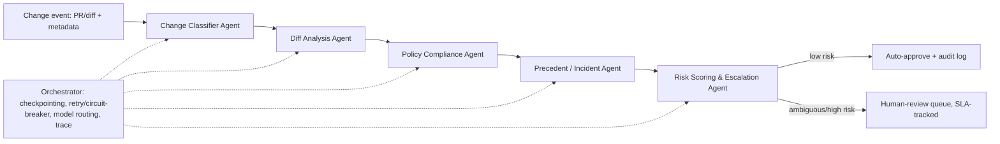

# Compliance Gatekeeper Agents

A multi-agent system that reviews incoming code/infrastructure changes and decides whether they comply with a **pluggable** security & compliance policy pack — auto-approving low-risk changes and escalating ambiguous or high-risk ones to a human reviewer with a full evidence trail.

Every line of code, every prompt, every diff, and every policy pack in this repository is written against **fully synthetic, procedurally generated** change data (see [`docs/SYNTHETIC_DATA.md`](docs/SYNTHETIC_DATA.md), added in Step 0). No employer, client, or third-party code or data is used anywhere in this project.

## Why this exists

Reviewing a code change against a security/compliance policy is a good stress test for production-grade agentic design, because it forces you to solve problems that show up in most real enterprise agent systems:

- **Dynamic reasoning, not a fixed checklist** — whether a diff violates a control depends on what the diff actually does, not a keyword match. The Policy Compliance Agent has to reason about the change, not classify it against a static list.
- **Grounding + auditability** — every compliance decision has to cite the specific diff lines and policy control it's based on. In a regulated setting, an ungrounded "looks fine" is worse than no automation at all.
- **Long-term memory used correctly** — has a change shaped like this caused a problem before? That's a retrieval question against a store of past incidents, not something that belongs in a single run's state.
- **Reliability under real failure modes** — the LLM backend can be slow, down, or wrong; the system needs bounded retries, a circuit breaker, and a confidence-gated human escalation path instead of ever silently guessing on a security decision.
- **Domain-agnostic by design** — the same engine runs against a generic software-security policy pack or an industry-specific one (e.g. BFSI: PCI-DSS, SOX, data-residency) by swapping a config file, not the code.

## Architecture



| Agent | Responsibility |
|---|---|
| Change Classifier | Decide change type (app code, IaC/Terraform, config, DB migration) and which systems/data it touches |
| Diff Analysis | Summarize what actually changed — new dependencies, new endpoints, altered access-control logic, changed data handling |
| Policy Compliance | Reason about whether the change violates any control in the **active policy pack** (pluggable config, not hardcoded), with confidence + cited evidence |
| Precedent / Incident | Vector-search past incidents/postmortems for a similar-shaped issue; surface supporting or contradicting precedent |
| Risk Scoring & Escalation | Combine findings into a risk score and decision; auto-approve with an audit-log entry, or escalate to a human-review queue with the full evidence trail |
| Orchestrator | Durable checkpointing, per-node timeout, bounded retry, circuit breaker on the LLM client, cost-aware model routing, stage-by-stage trace |

Built with **LangGraph** for explicit, conditionally-routed state-graph orchestration (not a fixed pipeline — routing depends on live findings), against a **swappable local LLM** (Ollama-compatible by default, same thin client interface can point at a hosted model later).

### Memory model

- **Short-term** — the LangGraph state for one change's run (diff, classification, findings, risk score, retry count, trace). Scoped to that run, checkpointed so a crash resumes instead of restarting.
- **Long-term** — external to the graph: a vector store of past incidents/postmortems and the active policy pack. Agent nodes are *clients* to these stores, the same way they'd be a client to any external API — LangGraph does not manage this memory.

See [`docs/ROADMAP.md`](docs/ROADMAP.md) for the build order and current status.

## Status

🚧 Early build. Repo scaffold in place; synthetic data engine and agents are being built one at a time, each with a working demo before moving to the next.

## Project layout

```text
compliance-gatekeeper-agents/
  src/compliance_gatekeeper_agents/
    synthetic/        # procedural synthetic diff + policy-pack + incident generator
    agents/            # one module per agent (added as they're built)
    graph/             # LangGraph orchestration wiring
  data/synthetic/       # generated synthetic fixtures (safe to commit — no real data)
  docs/                  # architecture + roadmap notes
  tests/
```

## License

MIT — see [`LICENSE`](LICENSE).
